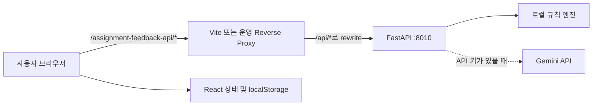

# Scholarly Affection × LectureLens 과제 첨삭 연동 명세

> 상태: **Integration v1 구현 완료**  
> 대상 프론트엔드: `scholarly-affection/`  
> 대상 첨삭 시스템: `assignment_feedback_system/`  
> 기준일: 2026-08-28  
> 목표 버전: Assignment Feedback Integration v1

## 1. 목적

연동 전 `scholarly-affection`의 과제 첨삭은 1.8초 타이머 뒤 무작위 등급과 고정 문구를 만드는 시뮬레이션이었다. Integration v1은 이를 `assignment_feedback_system`의 실제 FastAPI 첨삭 파이프라인과 연결해 다음 세 자료를 비교한 구조화된 결과를 제공한다.

1. 강의 요약본
2. 교수 과제 지시문
3. 학생 제출물

연동 후에도 기존의 교수별 기록, 호감도/스트레스 변화, 로컬 저장과 학술 로맨스 UI 콘셉트는 유지한다.

## 2. 성공 기준

연동 완료 상태는 다음을 모두 만족해야 한다.

- 과제 첨삭 모달에서 세 자료를 각각 텍스트 또는 파일로 입력할 수 있다.
- 텍스트만 사용하면 `POST /api/grade`, 하나라도 파일이면 `POST /api/grade-files`를 사용한다.
- FastAPI가 반환한 점수, 등급, 기준별 평가, 강점, 개선 우선순위, 오개념, 문장 교정, 개선 예시를 빠짐없이 표시한다.
- Gemini가 실패해 로컬 엔진으로 전환된 경우도 성공 응답으로 표시하고 전환 사유를 안내한다.
- 성공한 결과만 교수별 첨삭 기록에 저장하고 호감도/스트레스를 변경한다.
- 기존 localStorage의 과거 첨삭 기록이 깨지지 않고 계속 열려야 한다.
- API 키는 브라우저 번들에 포함하지 않는다.
- 개발 환경에서 CORS 오류 없이 두 앱을 함께 실행할 수 있다.

## 3. 현행 시스템 분석

### 3.1 프론트엔드 연동 전 동작

연동 전 `scholarly-affection/src/components/AssignmentReviewModal.tsx`는 다음 입력만 받았다.

- 리포트 제목
- 주제 칩
- 리포트 본문

제출 시 네트워크 요청 없이 클라이언트에서 다음을 생성한다.

- `A+`, `A`, `A-` 중 무작위 등급
- 고정 규칙 점수
- 정적 총평과 주석 2개
- 호감도 +15, 스트레스 -5

첨삭 기록은 `scholarly_assignments` localStorage 키에 교수별 `AssignmentRecord[]`로 저장된다.

### 3.2 백엔드 현행 동작

`assignment_feedback_system`은 FastAPI 앱이며 기본 주소는 `http://127.0.0.1:8010`이다.

```text
입력 3종
  ├─ 강의 요약본
  ├─ 교수 과제 지시문
  └─ 학생 제출물
       ↓
텍스트 추출 및 Pydantic 검증
       ↓
Gemini API 키 있음 ── 예 ─→ Gemini 구조화 첨삭
       │                         │ 실패
       아니오                    ↓
       └──────────────────→ 로컬 규칙 엔진
                                 ↓
                         FeedbackReport 반환
```

- `GRADE_GEMINI_API_KEY` 또는 `GEMINI_API_KEY`가 있으면 Gemini를 먼저 시도한다.
- 모델 기본값은 `gemini-2.5-flash`다.
- Gemini 호출·파싱이 실패하면 HTTP 오류를 반환하지 않고 로컬 규칙 엔진 결과를 HTTP 200으로 반환한다.
- API 키가 없으면 처음부터 로컬 규칙 엔진을 사용한다.
- 분석 기준 배점은 요구사항 30, 개념 정확성 35, 근거와 적용 20, 구성과 표현 15다.

### 3.3 검증된 백엔드 상태

분석 시점에 `assignment_feedback_system/tests`의 테스트 5개가 통과했다.

- 예제 데이터 3개 존재 확인
- 오개념 감지
- 우수/미완성 답안 점수 순서
- 텍스트 추출과 비지원 확장자 거부
- 예제 및 첨삭 API 기본 동작

## 4. 연동 범위

### 4.1 포함

- FastAPI 상태 확인
- 텍스트 JSON 첨삭 요청
- 텍스트/파일 혼합 multipart 요청
- 입력 사전 검증
- 로딩, 성공, 오류, 폴백 안내 UI
- 구조화 첨삭 결과 표시
- 교수별 기록 저장
- 기존 기록 호환
- Vite 개발 프록시
- 실행 방법과 환경 변수 문서화

### 4.2 제외

- 백엔드 첨삭 알고리즘 변경
- Gemini 프롬프트 변경
- OCR 기능 추가
- 사용자 계정, 서버 DB, 클라우드 파일 보관
- 업로드 파일의 브라우저 영구 저장
- 기존 강의 자료 모달의 시뮬레이션 데이터를 자동 첨삭 근거로 사용하는 기능
- 백엔드의 독립 웹 UI 제거
- 프로덕션 인증/과금/사용량 제한 구현

`LectureMaterialsModal`의 기존 요약은 정적 템플릿이므로 실제 강의 원문을 대표한다고 볼 수 없다. Integration v1에서는 자동으로 첨삭 입력에 사용하지 않는다.

## 5. 아키텍처 결정

### 5.1 서비스 분리 유지

FastAPI 앱과 React 앱은 별도 프로세스로 유지한다.



### 5.2 동일 출처 프록시

브라우저가 `http://127.0.0.1:8010`을 직접 호출하지 않는다. 프론트엔드와 같은 origin의 다음 공개 경로만 사용한다.

```text
/assignment-feedback-api/health
/assignment-feedback-api/grade
/assignment-feedback-api/grade-files
```

개발 환경의 Vite 프록시는 이 경로를 FastAPI의 `/api/*`로 변환한다.

```text
/assignment-feedback-api/grade
→ http://127.0.0.1:8010/api/grade
```

선정 이유:

- 현재 FastAPI에는 CORS 미들웨어가 없다.
- API 키나 내부 백엔드 주소를 브라우저 설정에 노출할 필요가 없다.
- 개발과 운영에서 프론트 코드의 요청 경로를 동일하게 유지할 수 있다.

### 5.3 Vite 개발 프록시 계약

`scholarly-affection/vite.config.ts`에 다음과 동등한 구성을 추가한다.

```ts
server: {
  proxy: {
    '/assignment-feedback-api': {
      target: process.env.ASSIGNMENT_FEEDBACK_TARGET ?? 'http://127.0.0.1:8010',
      changeOrigin: true,
      rewrite: (path) => path.replace(/^\/assignment-feedback-api/, '/api'),
    },
  },
}
```

`ASSIGNMENT_FEEDBACK_TARGET`은 Vite 개발 서버 프로세스 전용이며 브라우저에 노출되는 `VITE_*` 변수를 사용하지 않는다.

### 5.4 운영 배포 계약

운영 환경의 웹 서버 또는 게이트웨이는 `/assignment-feedback-api/*`를 FastAPI `/api/*`로 프록시해야 한다. 프론트 번들에는 운영 백엔드 호스트를 하드코딩하지 않는다.

## 6. 백엔드 API 계약

### 6.1 상태 확인

#### 요청

```http
GET /assignment-feedback-api/health
```

#### 원본 백엔드 경로

```http
GET /api/health
```

#### 응답

```json
{
  "status": "ok",
  "ai_enabled": true
}
```

`ai_enabled`는 API 키 존재 여부만 뜻한다. Gemini 호출 성공을 보장하지 않는다. 실제 처리 엔진은 첨삭 결과의 `engine`을 최종 기준으로 사용한다.

### 6.2 텍스트 전용 첨삭

세 입력이 모두 텍스트 모드일 때 사용한다.

#### 요청

```http
POST /assignment-feedback-api/grade
Content-Type: application/json
```

```json
{
  "lecture_summary": "20자 이상의 강의 요약",
  "assignment_prompt": "5자 이상의 교수 과제 지시",
  "student_submission": "5자 이상의 학생 제출물"
}
```

#### 길이 제한

| 필드 | 최소 | 최대 |
|---|---:|---:|
| `lecture_summary` | 20자 | 100,000자 |
| `assignment_prompt` | 5자 | 30,000자 |
| `student_submission` | 5자 | 100,000자 |

클라이언트는 전송 전에 앞뒤 공백을 제거하고 같은 제한을 검증한다.

### 6.3 파일 또는 혼합 첨삭

세 자료 중 하나라도 파일 모드이면 사용한다.

#### 요청

```http
POST /assignment-feedback-api/grade-files
Content-Type: multipart/form-data; boundary=...
```

브라우저가 boundary를 설정하도록 `Content-Type` 헤더를 직접 지정하지 않는다.

#### multipart 필드

| 자료 | 파일 필드 | 텍스트 필드 |
|---|---|---|
| 강의 요약본 | `lecture_file` | `lecture_text` |
| 교수 과제 지시문 | `assignment_file` | `assignment_text` |
| 학생 제출물 | `submission_file` | `submission_text` |

각 자료는 활성 입력 방식의 필드만 FormData에 넣는다. 서버는 같은 자료의 텍스트와 파일이 모두 있으면 공백이 아닌 텍스트를 우선하므로, 프론트는 둘을 동시에 보내지 않는다.

### 6.4 파일 계약

| 항목 | 규칙 |
|---|---|
| 허용 확장자 | `.txt`, `.md`, `.pdf`, `.docx` |
| 최대 크기 | 파일당 12MB |
| 추출 텍스트 | 최대 100,000자 |
| TXT/MD 인코딩 | UTF-8 BOM, UTF-8, CP949 순서로 시도 |
| PDF | 텍스트 기반 PDF만 지원 |
| DOCX | 본문 `word/document.xml`의 문단 텍스트 추출 |

다음 파일은 거부한다.

- 빈 파일
- 지원하지 않는 확장자
- 12MB 초과 파일
- 읽을 수 없는 문서
- 암호 때문에 열 수 없는 PDF
- 텍스트가 5자 미만이거나 추출되지 않는 스캔 PDF

스캔 PDF는 사용자가 OCR 처리 후 다시 업로드해야 한다.

### 6.5 성공 응답 — `FeedbackReport`

```json
{
  "title": "과제 첨삭 결과",
  "total_score": 86,
  "grade": "B",
  "summary": "전체 평가 요약",
  "criteria": [
    {
      "name": "요구사항 충족",
      "score": 26,
      "max_score": 30,
      "feedback": "지시문의 핵심 요소 반영",
      "evidence": "답안에서 확인된 근거"
    }
  ],
  "strengths": ["잘한 점"],
  "priorities": ["우선 고칠 점"],
  "misconceptions": ["오개념"],
  "line_edits": [
    {
      "original": "기존 문장",
      "revised": "수정 문장",
      "reason": "수정 이유"
    }
  ],
  "improved_example": "개선된 답안 예시",
  "engine": "Gemini 구조화 첨삭",
  "caution": "자동 첨삭 결과는 교수자의 최종 판단을 보조하는 자료입니다."
}
```

#### 필드 규칙

| 필드 | 렌더링 규칙 |
|---|---|
| `title` | 결과 섹션 제목. 기록 제목과 구분 |
| `total_score` | 0..100 정수 |
| `grade` | 현재 엔진 기준 A/B/C/D/F |
| `summary` | 교수 첨삭 총평 영역 |
| `criteria` | 반환 순서대로 점수 막대 렌더링 |
| `strengths` | 빈 배열이면 빈 상태 문구 표시 |
| `priorities` | 우선순위 번호 목록 |
| `misconceptions` | 있을 때만 경고 섹션 표시 |
| `line_edits` | 원문 → 수정문 → 이유 카드 |
| `improved_example` | 개선 예시 전용 양피지 카드 |
| `engine` | 실제 처리 엔진 배지 |
| `caution` | 항상 결과 하단에 표시 |

클라이언트는 criteria가 항상 네 개라고 가정하지 않고 반환 배열 전체를 렌더링한다.

### 6.6 엔진과 폴백 표시

| 상황 | HTTP | `engine` | UI |
|---|---:|---|---|
| API 키 없음 | 200 | `로컬 규칙 엔진` | 로컬 첨삭 배지 |
| Gemini 성공 | 200 | `Gemini 구조화 첨삭` | AI 정밀 첨삭 배지 |
| Gemini 실패 후 폴백 | 200 | `로컬 규칙 엔진` | 로컬 배지 + `caution` 경고 |

Gemini 폴백은 실패 화면으로 처리하지 않는다. 결과를 정상 저장할 수 있어야 한다.

### 6.7 오류 응답

FastAPI의 422 오류는 두 형태가 가능하다.

#### 문서 처리 오류

```json
{
  "detail": "lecture.pdf: 추출할 텍스트가 없습니다. 스캔 PDF라면 OCR 후 다시 업로드해 주세요."
}
```

#### Pydantic 검증 오류

```json
{
  "detail": [
    {
      "type": "string_too_short",
      "loc": ["body", "lecture_summary"],
      "msg": "String should have at least 20 characters",
      "input": "짧은 입력"
    }
  ]
}
```

클라이언트 오류 정규화 함수는 다음 우선순위를 사용한다.

1. `detail`이 문자열이면 그대로 표시.
2. `detail`이 배열이면 각 항목의 마지막 `loc`과 `msg`를 결합.
3. JSON이 아니거나 알려지지 않은 형태면 HTTP 상태별 기본 문구.
4. 네트워크 연결 실패면 `과제 첨삭 서버에 연결할 수 없습니다.` 표시.

## 7. 프론트엔드 서비스 계층

### 7.1 신규 모듈

`src/services/assignmentFeedback.ts`를 추가해 UI 컴포넌트에서 fetch 세부 구현을 분리한다.

필수 공개 함수:

```ts
getAssignmentFeedbackHealth(signal?: AbortSignal): Promise<AssignmentFeedbackHealth>
gradeAssignment(input: AssignmentFeedbackInput, signal?: AbortSignal): Promise<FeedbackReport>
```

내부 책임:

- 텍스트/파일 요청 방식 결정
- JSON 또는 FormData 생성
- 90초 타임아웃
- HTTP/네트워크 오류 정규화
- 응답 JSON을 런타임에서 최소 검증
- AbortSignal 전달

### 7.2 API 기본 경로

```ts
const ASSIGNMENT_FEEDBACK_API_BASE = '/assignment-feedback-api';
```

브라우저 코드에 `127.0.0.1:8010`을 직접 넣지 않는다.

### 7.3 요청 선택 알고리즘

```text
세 입력 검증
  ↓
모두 text 모드인가?
  ├─ 예 → JSON /grade
  └─ 아니오 → FormData /grade-files
                  ├─ text 모드: *_text
                  └─ file 모드: *_file
```

### 7.4 요청 중복과 취소

- 요청 시작부터 완료까지 제출 버튼을 비활성화한다.
- 자동 재시도하지 않는다. Gemini 호출 비용과 중복 기록을 피하기 위해 재시도는 사용자가 직접 수행한다.
- 모달을 닫거나 새 요청을 시작하면 이전 fetch를 `AbortController`로 취소한다.
- 취소는 오류 토스트를 표시하지 않는다.
- 백엔드 처리가 이미 시작된 경우 서버 측 Gemini 호출까지 취소된다는 보장은 없다.

## 8. 프론트엔드 타입 명세

### 8.1 API 타입

`src/types.ts` 또는 `src/types/assignmentFeedback.ts`에 다음 구조를 추가한다.

```ts
export type AssignmentInputMode = 'text' | 'file';

export interface AssignmentSourceInput {
  mode: AssignmentInputMode;
  text: string;
  file: File | null;
}

export interface AssignmentFeedbackInput {
  lecture: AssignmentSourceInput;
  assignment: AssignmentSourceInput;
  submission: AssignmentSourceInput;
}

export interface AssignmentFeedbackHealth {
  status: string;
  ai_enabled: boolean;
}

export interface FeedbackCriterion {
  name: string;
  score: number;
  max_score: number;
  feedback: string;
  evidence: string;
}

export interface FeedbackLineEdit {
  original: string;
  revised: string;
  reason: string;
}

export interface AssignmentFeedbackReport {
  title: string;
  total_score: number;
  grade: string;
  summary: string;
  criteria: FeedbackCriterion[];
  strengths: string[];
  priorities: string[];
  misconceptions: string[];
  line_edits: FeedbackLineEdit[];
  improved_example: string;
  engine: string;
  caution: string;
}
```

`File` 객체는 React 컴포넌트 상태에만 존재하며 localStorage에 직렬화하지 않는다.

### 8.2 첨삭 기록 확장

기존 `AssignmentRecord` 필드는 유지하고 새 필드를 선택적으로 추가한다.

```ts
export type AssignmentGrade =
  | 'A+' | 'A' | 'A-'
  | 'B+' | 'B' | 'B-'
  | 'C' | 'D' | 'F';

export interface AssignmentInputSnapshot {
  mode: AssignmentInputMode;
  fileName?: string;
  fileSize?: number;
  preview: string;
}

export interface AssignmentRecord {
  // 기존 필드 유지
  id: string;
  professorId: string;
  title: string;
  topic: string;
  content: string;
  grade: AssignmentGrade;
  score: number;
  summaryFeedback: string;
  annotations: {
    text: string;
    note: string;
    type: 'praise' | 'critique' | 'question';
  }[];
  timestamp: string;
  affectionGained: number;

  // v2 연동 필드
  schemaVersion?: 2;
  inputSnapshots?: {
    lecture: AssignmentInputSnapshot;
    assignment: AssignmentInputSnapshot;
    submission: AssignmentInputSnapshot;
  };
  feedbackReport?: AssignmentFeedbackReport;
}
```

### 8.3 하위 호환

- `feedbackReport`가 없는 기존 레코드는 legacy 상세 UI로 표시한다.
- `feedbackReport`가 있는 신규 레코드는 구조화 결과 UI로 표시한다.
- 기존 초기 데이터와 localStorage 데이터를 강제 삭제하거나 마이그레이션하지 않는다.
- `grade` 타입에 D와 F를 추가해 백엔드 결과를 허용한다.

### 8.4 localStorage 크기 제한

백엔드 입력 상한 전체를 localStorage에 그대로 저장하면 기록이 누적될 때 브라우저 용량 한도를 빠르게 초과할 수 있다. 따라서 새 기록에는 원본 전체 대신 다음만 저장한다.

| 입력 | 저장 내용 |
|---|---|
| 텍스트 강의 요약 | 앞 500자 preview |
| 텍스트 과제 지시 | 앞 500자 preview |
| 텍스트 학생 제출물 | 앞 2,000자 preview 및 기존 `content` |
| 파일 입력 | 파일명, 파일 크기, 비어 있는 preview |
| 첨삭 결과 | `FeedbackReport` 전체 |

원본 파일 바이트와 전체 강의/과제 텍스트는 저장하지 않는다. `content`는 학생 제출물 preview와 동일하게 최대 2,000자로 제한한다.

## 9. 결과 → 기존 기록 매핑

API 성공 응답을 다음과 같이 `AssignmentRecord`로 변환한다.

| AssignmentRecord | 원본 |
|---|---|
| `id` | `asg-${Date.now()}` |
| `professorId` | 현재 활성 교수 ID |
| `title` | 사용자가 입력한 기록 제목 |
| `topic` | 교수 과제 지시 preview, 최대 80자 |
| `content` | 학생 제출 텍스트 preview 또는 `[파일 제출] {fileName}` |
| `grade` | `report.grade` |
| `score` | `report.total_score` |
| `summaryFeedback` | `report.summary` |
| `annotations` | `line_edits`를 critique 주석으로 변환 |
| `timestamp` | 사용자 로컬 시간 기준 표시 문자열 |
| `affectionGained` | 15 |
| `schemaVersion` | 2 |
| `inputSnapshots` | 세 입력의 안전한 메타데이터/preview |
| `feedbackReport` | API 응답 전체 |

문장 교정 매핑:

```ts
annotations = report.line_edits.map((edit) => ({
  text: edit.original,
  note: `${edit.revised} — ${edit.reason}`,
  type: 'critique',
}));
```

Integration v1에서는 기존 게임 밸런스를 유지해 성공한 첨삭 결과에 호감도 +15, 스트레스 -5를 적용한다. 점수나 엔진 종류에 따라 보상값을 달리하지 않는다.

## 10. 과제 첨삭 모달 UX

### 10.1 상태 모델

```ts
type GradingState =
  | { status: 'idle' }
  | { status: 'checking' }
  | { status: 'submitting' }
  | { status: 'success'; report: AssignmentFeedbackReport }
  | { status: 'error'; message: string };
```

### 10.2 모달 진입

- 모달을 열면 기존처럼 활성 교수 아바타, 이름, 전공을 표시한다.
- 백그라운드에서 health를 한 번 조회한다.
- 조회 중에는 `첨삭 엔진 확인 중`.
- 성공 시 `AI 키 감지됨` 또는 `로컬 첨삭 모드`.
- 실패 시 `첨삭 서버 연결 필요`와 재확인 버튼을 표시하고 제출을 비활성화한다.

health의 `ai_enabled: true`를 `AI 첨삭 확정`으로 표현하지 않는다.

### 10.3 탭

- `새 과제 첨삭`
- `첨삭 기록 ({교수별 개수})`

### 10.4 새 첨삭 폼

#### 기록 제목

- localStorage 기록을 구분하기 위한 프론트 전용 필드.
- 필수, 최대 120자.
- 학생 파일을 선택했고 제목이 비어 있으면 확장자를 제외한 파일명으로 자동 채움.

#### 자료 카드 1 — 강의 요약본

- 텍스트 붙여넣기 / 파일 업로드 토글.
- 안내: `평가 기준이 되는 강의 핵심 내용`.
- 텍스트 모드 최소 20자.

#### 자료 카드 2 — 교수 과제 지시문

- 텍스트 붙여넣기 / 파일 업로드 토글.
- 안내: `분량, 필수 개념, 제출 형식 등 과제 요구사항`.
- 텍스트 모드 최소 5자.

#### 자료 카드 3 — 학생 제출물

- 텍스트 붙여넣기 / 파일 업로드 토글.
- 안내: `실제로 평가할 학생의 답안 또는 리포트`.
- 텍스트 모드 최소 5자.

#### 파일 카드 공통

- 클릭 선택을 우선 지원한다.
- 드래그 앤 드롭을 UI에 표시하려면 실제 `dragover/drop` 처리를 함께 구현한다.
- 허용 파일과 12MB 제한을 선택 직후 검증한다.
- 파일명, 크기, 제거 버튼을 표시한다.
- 모드를 전환하면 비활성 모드의 값을 지워 서버 우선순위 혼동을 방지한다.

### 10.5 제출 중

- 문구: `강의 내용과 과제 요구사항을 비교해 첨삭 중...`
- 제출 버튼, 입력, 모드 토글을 비활성화한다.
- 기존 1.8초 가짜 타이머를 제거한다.
- 실제 요청이 끝날 때까지 로딩 상태를 유지한다.
- 모달 닫기를 누르면 `첨삭 요청을 취소할까요?` 확인 후 Abort한다.

### 10.6 성공 결과 화면

한 화면에 다음 순서로 표시한다.

1. 점수, 등급, 실제 엔진 배지
2. 종합 평가 요약
3. 평가 기준별 점수 막대와 근거
4. 잘한 점
5. 우선 개선할 점
6. 오개념 — 있을 때만
7. 문장별 교정 — 원문, 수정문, 이유
8. 개선된 답안 예시
9. 자동 첨삭 주의문
10. `새 과제 첨삭`, `기록 목록으로` 액션

결과는 API 응답을 받은 직후 `onAddAssignment`로 한 번만 저장한다. 렌더 재실행이나 탭 이동으로 중복 저장되면 안 된다.

### 10.7 오류 화면

- 사용자가 입력한 텍스트와 선택 파일 상태를 유지한다.
- 오류 문구와 `다시 첨삭하기` 버튼을 표시한다.
- API 오류 시 교수 스탯과 첨삭 기록을 변경하지 않는다.
- 서버 연결 오류는 health 재확인 동선을 함께 제공한다.

### 10.8 첨삭 기록 상세

신규 v2 기록은 성공 결과 화면과 동일한 구조로 다시 렌더링한다. 파일 입력은 파일명과 당시 크기만 표시하며 다운로드 버튼을 제공하지 않는다.

legacy 기록은 현재 UI를 유지한다.

## 11. 비즈니스 규칙

### 11.1 성공 판정

다음 조건을 모두 만족해야 성공으로 기록한다.

- HTTP 2xx
- 응답 JSON 파싱 성공
- `total_score`, `grade`, `summary`, `criteria`, `engine` 필수 형태 확인

`engine`이 로컬 규칙 엔진이어도 성공이다.

### 11.2 스탯 변경

- 성공: 호감도 +15, 스트레스 -5.
- 입력 오류, 서버 오류, 취소: 변화 없음.
- 같은 결과를 기록에서 다시 열기: 변화 없음.
- 사용자가 수동으로 재요청해 새 성공 결과를 받으면 별도 기록으로 간주하고 다시 변화.

### 11.3 효과음

| 시점 | 효과음 |
|---|---|
| 제출 시작 | `playPageTurn` |
| 성공 결과 | `playGradeChime` 후 `playAffectionUp` |
| 입력 오류/서버 오류 | 기존 클릭음 외 성공 효과음 없음 |
| 기록 상세 열기 | `playPageTurn` |

## 12. 오류 및 경계 상황

| 상황 | 기대 동작 |
|---|---|
| 백엔드 미실행 | 연결 오류, 입력 유지, 기록/스탯 변화 없음 |
| health 실패 | 제출 비활성, 재확인 제공 |
| 입력 길이 부족 | 클라이언트 필드 오류, 요청하지 않음 |
| 지원하지 않는 확장자 | 파일 선택 직후 거부 |
| 12MB 초과 | 파일 선택 직후 거부 |
| 스캔 PDF | 서버 422 메시지 표시 |
| 일부 텍스트 + 일부 파일 | `/grade-files`로 정상 전송 |
| Gemini 실패 | 로컬 결과 정상 표시·저장, caution 강조 |
| 90초 초과 | 타임아웃 오류, 수동 재시도 가능 |
| 사용자가 요청 중 닫기 | 확인 후 abort, 기록 없음 |
| 빈 strengths 등 배열 | 해당 섹션에 빈 상태 또는 섹션 숨김 |
| criteria의 `max_score` 0 | 응답 오류로 처리해 0 나눗셈 방지 |
| localStorage quota 초과 | 결과는 화면에 유지, 저장 실패 안내, 스탯 변경은 저장 성공 뒤 수행 |

localStorage 저장과 교수 스탯 변경은 하나의 사용자 결과로 취급한다. 저장 실패 시 `onAddAssignment`를 완료한 것으로 처리하지 않아야 한다.

## 13. 보안과 개인정보

- Gemini API 키는 FastAPI 프로세스 환경 변수에만 둔다.
- `VITE_GEMINI_API_KEY` 같은 브라우저 노출 변수는 사용하지 않는다.
- 모든 결과 문자열은 React 텍스트 노드로 렌더링하고 `dangerouslySetInnerHTML`을 사용하지 않는다.
- 파일 확장자·크기는 프론트와 백엔드에서 모두 검증한다.
- 업로드 원본 파일을 localStorage에 저장하지 않는다.
- 백엔드는 인증이 없으므로 개발 환경에서는 `127.0.0.1` 바인딩을 유지한다.
- 인터넷에 공개할 경우 인증, 요청 크기 제한, rate limit, TLS, 감사 로그를 별도 설계해야 한다.
- 자동 첨삭 결과는 최종 성적 확정이 아니라 교수자 판단을 보조하는 자료임을 항상 표시한다.

## 14. 실행 환경

### 14.1 백엔드

작업공간 루트의 `.venv`를 사용한다.

```powershell
cd "C:\Users\bman4\Desktop\새 폴더"
.\assignment_feedback_system\run_assignment_grader.ps1
```

Gemini를 사용할 때는 백엔드 실행 전 같은 PowerShell 세션에 환경 변수를 설정한다.

```powershell
$env:GRADE_GEMINI_API_KEY="실제 키"
$env:GRADE_GEMINI_MODEL="gemini-2.5-flash"
.\assignment_feedback_system\run_assignment_grader.ps1
```

`.env.example` 파일을 복사하는 것만으로는 현재 실행 스크립트가 자동 로드하지 않는다. Integration v1 구현 시 실행 스크립트에 `.env` 로드를 추가하지 않는다면 환경 변수 설정 방식을 README에 명확히 유지한다.

### 14.2 프론트엔드

다른 PowerShell에서 실행한다.

```powershell
cd "C:\Users\bman4\Desktop\새 폴더\scholarly-affection"
npm install
npm run dev
```

브라우저 주소:

```text
http://localhost:3000
```

두 프로세스가 모두 실행되어야 실제 첨삭이 동작한다.

## 15. 구현 대상 파일

### 15.1 프론트엔드 변경

| 파일 | 변경 |
|---|---|
| `vite.config.ts` | `/assignment-feedback-api` 개발 프록시 추가 |
| `src/types.ts` | API 및 v2 기록 타입 추가, D/F 등급 허용 |
| `src/services/assignmentFeedback.ts` | health, JSON/multipart 요청, 오류 정규화 |
| `src/components/AssignmentSourceInput.tsx` | 텍스트/파일 공통 입력 카드 신규 작성 |
| `src/components/AssignmentFeedbackResult.tsx` | 구조화 결과 렌더러 신규 작성 |
| `src/components/AssignmentReviewModal.tsx` | 가짜 채점 제거, 실제 API·상태·기록 UI 연결 |
| `src/App.tsx` | 기존 저장/스탯 흐름 유지, 저장 오류 처리 보완 |
| `README.md` | 백엔드 포함 실행 순서 추가 |

구현 과정에서 컴포넌트명은 조정할 수 있지만 서비스 계층과 결과 렌더러는 모달에서 분리해야 한다.

### 15.2 백엔드 변경

MVP 연동에는 필수 백엔드 코드 변경이 없다. 다음은 선택 개선이다.

- 요청 ID와 구조화 로그
- 서버 타임아웃
- `.env` 명시적 로드
- 프론트용 오류 코드 필드
- 원본 추출 텍스트 preview를 응답하는 옵션

## 16. 테스트 계획

### 16.1 백엔드 회귀

기존 테스트를 계속 통과해야 한다.

```powershell
cd "C:\Users\bman4\Desktop\새 폴더\assignment_feedback_system"
..\.venv\Scripts\python.exe -m pytest .\tests -q
```

### 16.2 프론트 서비스 테스트

- 세 입력이 모두 텍스트면 JSON endpoint 사용.
- 하나라도 파일이면 multipart endpoint 사용.
- FormData 필드명이 백엔드 계약과 일치.
- multipart에서 `Content-Type` 직접 설정 안 함.
- 문자열 및 배열형 422 오류 정규화.
- Abort와 timeout 처리.
- Gemini 폴백 200 응답을 성공으로 처리.

### 16.3 기록 매핑 테스트

- 응답 필드가 `AssignmentRecord`에 정확히 매핑됨.
- D/F 등급 저장 가능.
- line edits가 critique annotations로 변환됨.
- preview 길이 제한 준수.
- legacy 레코드와 v2 레코드 모두 상세 렌더링.
- 결과 한 건당 호감도/스트레스가 한 번만 변경됨.

### 16.4 통합 테스트 시나리오

1. 텍스트 3종 + 로컬 엔진 성공.
2. TXT/MD/PDF/DOCX 혼합 업로드 성공.
3. 우수, 오개념, 미완성 예제의 결과 차이 확인.
4. 스캔 PDF 422 표시.
5. 지원하지 않는 파일의 프론트 차단.
6. API 키가 있으나 Gemini 실패하여 로컬 폴백.
7. 백엔드를 끈 상태에서 연결 오류와 입력 유지.
8. 새로고침 후 v2 기록 복원.
9. 기존 초기 첨삭 기록 열기.
10. 모바일 화면에서 세 입력과 결과 스크롤 가능.

## 17. 완료 조건 체크리스트

- [x] 기존 무작위 등급과 `setTimeout` 가짜 채점 로직 제거
- [x] Vite 동일 출처 프록시 적용
- [x] health 상태 표시
- [x] 세 자료의 텍스트/파일 입력 구현
- [x] JSON과 multipart 요청 분기 구현
- [x] 파일 확장자·크기·텍스트 길이 검증
- [x] 구조화 결과의 모든 필드 표시
- [x] Gemini 폴백 결과 정상 처리
- [x] 기존/신규 기록 하위 호환
- [x] 파일 원본 localStorage 미저장
- [x] 성공 시에만 기록 및 교수 스탯 변경
- [x] 오류 시 입력 유지와 수동 재시도
- [x] 백엔드 테스트, 프론트 lint/build, 프록시 통합 요청 검증
- [x] 두 프로세스 실행 방법 README 반영

## 18. 구현 순서

1. API 타입과 서비스 계층 작성.
2. Vite 프록시 설정 및 health 연결 확인.
3. 세 자료 공통 입력 컴포넌트 작성.
4. 과제 모달의 가짜 채점 로직을 실제 요청 상태로 교체.
5. 구조화 결과 컴포넌트 작성.
6. AssignmentRecord v2 저장 및 legacy 분기 추가.
7. 오류, 취소, localStorage quota 처리.
8. 자동 테스트와 실제 두 프로세스 통합 검증.
9. 실행 문서 갱신.

---

이 연동의 핵심 원칙은 **첨삭 시스템의 기존 API와 로컬 폴백을 그대로 활용하고, 프론트에서는 동일 출처 프록시·구조화 결과 보존·기존 기록 호환만 책임지는 것**이다.
