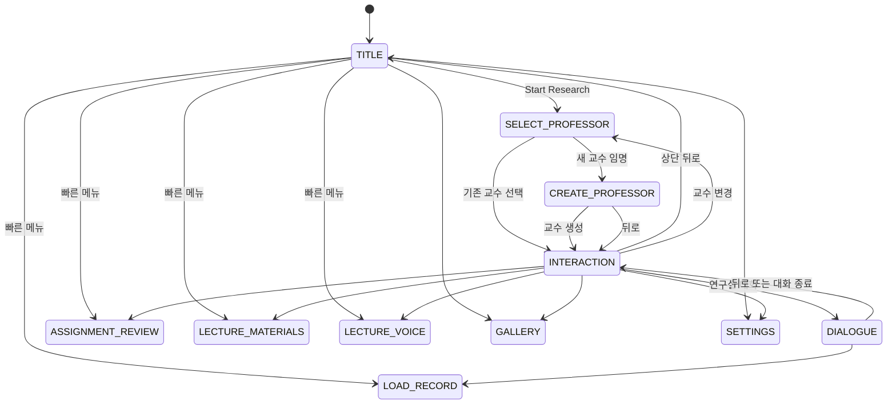
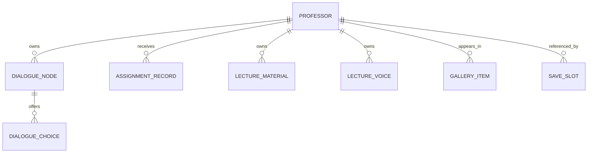

# Scholarly Affection 웹 애플리케이션 구조 명세

> 문서 성격: 현재 소스 코드를 역분석한 **As-Is 구현 명세**  
> 기준 경로: `scholarly-affection/`  
> 분석 기준일: 2026-08-28  
> 소스 오브 트루스: `src/App.tsx`, `src/components/*`, `src/types.ts`, `src/data/initialData.ts`, `src/index.css`

## 1. 문서 목적과 판독 기준

이 문서는 현재 웹사이트의 화면 구조, 탐색 흐름, 상태, 데이터 모델, 비즈니스 규칙, 시각 체계와 실제 동작 범위를 재구현 가능한 수준으로 정리한다.

UI에 표시되는 문구와 실제 처리가 다른 경우에는 다음 기준을 사용한다.

- **구현됨**: 브라우저에서 실제 상태나 데이터가 변경된다.
- **시뮬레이션**: 로딩 시간, 분석 결과, 녹음, 재생 등을 정적 데이터와 타이머로 흉내 낸다.
- **미연결**: 컴포넌트 또는 상태는 존재하지만 사용자가 진입할 수 있는 동선이 없다.
- **미구현**: UI 문구는 기능을 암시하지만 대응하는 처리 로직이 없다.

본 문서는 향후 목표 제품을 추정하지 않는다. 별도 표시가 없는 요구사항은 모두 현재 코드가 보여주는 동작을 뜻한다.

## 2. 제품 개요

### 2.1 제품 정의

`Scholarly Affection(학문적 애정)`은 지도 교수를 선택하거나 새로 만들고, 교수와 비주얼 노벨 형태의 대화를 나누며, 과제 첨삭·강의 자료·강의 음성 기록을 관리하는 학술 로맨스 콘셉트의 단일 페이지 웹 애플리케이션이다.

### 2.2 핵심 사용자 경험

1. 타이틀 화면에서 연구를 시작한다.
2. 지도 교수를 선택하거나 사용자 정의 교수를 만든다.
3. 연구실 화면에서 교수의 호감도와 스트레스를 확인한다.
4. 분기형 대화에서 선택지를 골라 두 수치를 변화시킨다.
5. 과제, 강의 자료, 강의 음성 기록을 교수별로 추가하고 열람한다.
6. 로컬 저장 슬롯으로 현재 여정을 표시·불러오기 한다.
7. 갤러리와 환경 설정을 확인한다.

### 2.3 현재 범위

- 회원가입, 로그인, 사용자 계정이 없는 단일 사용자 구조다.
- 별도 URL 라우트가 없는 클라이언트 단일 페이지 앱이다.
- 데이터는 서버가 아니라 브라우저 `localStorage`에 저장된다.
- 과제 첨삭은 `assignment_feedback_system` FastAPI 서버와 연결되어 Gemini 또는 로컬 규칙 엔진을 사용한다.
- 강의 자료 분석, 음성 전사와 실제 녹음/재생 백엔드는 아직 연결되어 있지 않다.
- 외부 통신은 Google Fonts와 Google 호스팅 이미지 로드에만 사용된다.

## 3. 기술 및 실행 구조

### 3.1 기술 스택

| 영역 | 현재 구성 |
|---|---|
| UI 런타임 | React 19, React DOM 19 |
| 언어 | TypeScript 5.8, TSX |
| 빌드/개발 서버 | Vite 6, 기본 개발 포트 3000 |
| 스타일 | Tailwind CSS 4 + `src/index.css` 사용자 정의 클래스 |
| 아이콘 | Google Material Symbols 웹폰트 |
| 폰트 | Google Fonts: Hanken Grotesk, Libre Caslon Text, Literata |
| 사운드 | Web Audio API로 런타임 합성 |
| 영속 저장 | 브라우저 `localStorage` |
| 이미지 | 원격 `lh3.googleusercontent.com` URL |

`@google/genai`, `express`, `dotenv`, `motion`, `lucide-react`가 의존성에 선언되어 있으나 현재 `src` 구현에서는 사용되지 않는다.

### 3.2 엔트리 포인트

```text
index.html
└─ #root
   └─ src/main.tsx
      └─ <StrictMode>
         └─ <App />
```

- 문서 언어는 `ko`다.
- `src/main.tsx`가 전역 CSS를 불러오고 `App`을 마운트한다.
- `App`이 모든 도메인 데이터, 화면 상태와 모달 상태를 소유한다.
- Context, Redux/Zustand 같은 별도 상태 관리 계층은 없다.

### 3.3 컴포넌트 트리

```text
App
├─ TitleScreen
├─ ProfessorInteractionScreen
│  └─ TopAppBar
├─ ProfessorCreateScreen
│  └─ TopAppBar
├─ DialogueScreen
├─ ProfessorSelectModal
├─ AssignmentReviewModal
│  ├─ AssignmentSourceInput
│  └─ AssignmentFeedbackResult
├─ LectureMaterialsModal
├─ LectureVoiceModal
├─ SaveLoadModal
├─ GalleryModal
└─ SettingsModal
```

화면 컴포넌트는 동시에 하나만 렌더링된다. 모달은 현재 화면 위에 하나만 렌더링된다.

## 4. 정보 구조와 화면 전환

### 4.1 상태 기반 내비게이션

URL 라우터 대신 다음 두 상태가 전체 탐색을 결정한다.

- `currentScreen`: 기본 화면
  - 실제 사용값: `TITLE`, `INTERACTION`, `CREATE_PROFESSOR`, `DIALOGUE`
- `activeModal`: 오버레이
  - `SELECT_PROFESSOR`, `ASSIGNMENT_REVIEW`, `LECTURE_MATERIALS`, `LECTURE_VOICE`, `SAVE_RECORD`, `LOAD_RECORD`, `GALLERY`, `SETTINGS`, `null`

`Screen` 타입에는 모달 이름도 포함되어 있으나 기본 화면 렌더링 분기에는 사용되지 않는다.

### 4.2 사용자 흐름



타이틀의 과제·자료·음성 빠른 메뉴는 먼저 기본 화면을 `INTERACTION`으로 바꾼 뒤 모달을 연다. 따라서 해당 모달을 닫으면 타이틀이 아니라 연구실 화면이 나타난다.

### 4.3 URL 및 브라우저 탐색

- 모든 화면이 동일 URL을 사용한다.
- 브라우저 뒤로/앞으로 버튼과 앱 화면 상태는 연동되지 않는다.
- 새로고침하면 기본 화면은 항상 `TITLE`로 돌아간다.
- 저장된 교수와 기록 데이터는 남지만 열려 있던 화면이나 모달은 복원되지 않는다.

## 5. 공통 도메인 규칙

### 5.1 활성 교수

`selectedProfessorId`와 일치하는 교수를 활성 교수로 사용한다. 일치하는 항목이 없으면 교수 배열의 첫 항목을 화면에 표시한다.

### 5.2 호감도와 스트레스

- 두 값의 저장 범위는 각각 `0..100`이다.
- 모든 변경값은 더한 뒤 범위 밖을 0 또는 100으로 보정한다.
- 연구실의 잉크병 그래프는 값이 0이어도 시각적으로 최소 5% 높이를 표시한다.

| 이벤트 | 호감도 변화 | 스트레스 변화 |
|---|---:|---:|
| 대화 선택지 | 선택지별 값 | 선택지별 값 |
| 과제 첨삭 추가 | `affectionGained`(현재 생성값 +15) | -5 |
| 강의 자료 추가 | +8 | -4 |
| 강의 음성 추가 | +10 | -5 |
| 새 교수 생성 | 초기값 50 | 초기값 20 |

### 5.3 식별자와 시간

- 사용자 생성 레코드는 `Date.now()` 기반 ID를 사용한다.
- 예: `custom-prof-{timestamp}`, `asg-{timestamp}`, `mat-{timestamp}`, `voice-{timestamp}`.
- 시간 표시는 `new Date().toISOString()`에서 앞 16자를 사용하므로 사용자 로컬 시간대가 아닌 UTC 기준 문자열이다.

### 5.4 교수별 기록 분리

과제, 강의 자료, 강의 음성은 모달을 열 때 활성 교수 ID로 필터링한다. 한 교수의 기록은 다른 교수 화면에 표시되지 않는다.

## 6. 화면별 명세

### 6.1 타이틀 화면 — `TitleScreen`

#### 목적

앱의 진입점이자 주요 기능의 빠른 실행 허브다.

#### 레이아웃

- 전체 화면 원격 배경 이미지와 네이비/골드 그라데이션 오버레이.
- 좌측 상단: 로고 이미지와 문구 `학문과 이성의 전당에서 피어나는 은밀한 교감`.
- 좌측 하단: 반투명 메뉴 패널.
- 최하단: `v1.0.4 | © Aesthetica Academy`와 데스크톱용 안내 문구.

#### 동작

| 컨트롤 | 결과 |
|---|---|
| Start Research | 교수 선택 모달 열기 |
| 과제 첨삭 받기 | 연구실 화면으로 전환 후 과제 첨삭 모달 열기 |
| 강의 자료 올리기 | 연구실 화면으로 전환 후 자료 모달 열기 |
| 강의 음성 올리기 | 연구실 화면으로 전환 후 음성 모달 열기 |
| Load Record | 불러오기 모달 열기 |
| Gallery | 갤러리 모달 열기 |
| Settings | 설정 모달 열기 |

각 버튼은 클릭, 종이 넘김 또는 만년필 효과음을 재생한다.

### 6.2 지도 교수 선택 모달 — `ProfessorSelectModal`

#### 레이아웃

- 최대 너비 `2xl`의 라이트 글래스 패널.
- 모바일 1열, `sm` 이상 2열 교수 카드 목록.
- 목록 최대 높이는 뷰포트의 50%이며 내부 스크롤한다.
- 카드에는 아바타, 이름, 전공, 호감도, 스트레스가 표시된다.
- 사용자 생성 교수에는 아바타 위 `Custom` 배지가 붙는다.

#### 동작

- 현재 선택 교수 카드는 골드 테두리와 링으로 강조한다.
- 교수 카드 선택 시 해당 교수를 활성화하고 `INTERACTION` 화면으로 이동한다.
- `+ 새로운 교수 임명하기` 선택 시 `CREATE_PROFESSOR` 화면으로 이동한다.
- 배경 또는 닫기 버튼 선택 시 현재 모달만 닫는다.

### 6.3 교수 연구실 화면 — `ProfessorInteractionScreen`

#### 목적

활성 교수의 상태를 보여주고 대화와 학술 기록 기능으로 진입시키는 중심 허브다.

#### 데스크톱 레이아웃 (`md` 이상)

- 전체 화면: 교수별 연구실 배경.
- 고정 상단바: 80px 높이.
- 좌측 420px 스크롤 패널:
  - 교수 이름, 전공, 직함.
  - 호감도/스트레스 세로 잉크병.
  - 교수 성격 설명.
  - 대화, 과제, 자료, 음성 버튼.
- 우측: 바닥에 정렬된 교수 전신 스프라이트. 최대 높이 850px, 대략 뷰포트 높이의 88%.

#### 모바일 레이아웃 (`md` 미만)

- 전신 스프라이트를 숨긴다.
- 좌측 패널이 전체 너비를 사용한다.
- 하단에 Talk, Feedback, Materials, Lecture 네 개 고정 내비게이션을 표시한다.
- 본문 하단에 내비게이션 공간 80px을 확보한다.

#### 상단바 동작

| 컨트롤 | 결과 |
|---|---|
| 뒤로 | 타이틀 화면 이동 |
| 음량 아이콘 | 효과음 활성/음소거 전환 |
| 책 아이콘 | 갤러리 열기 |
| 학사모 아이콘 | 교수 선택 열기 |
| 교수 아바타 | 교수 선택 열기 |

`Settings` 진입 콜백은 이 화면에 전달되지만 현재 연구실 UI에는 설정 버튼이 없다.

#### 주요 액션

- 연구실 대화하기 → `DIALOGUE`
- 과제 첨삭하기 → 과제 첨삭 모달
- 강의 자료 올리기 → 강의 자료 모달
- 강의 음성 올리기 → 강의 음성 모달

### 6.4 새 교수 임명 화면 — `ProfessorCreateScreen`

#### 입력 필드

| 필드 | 초기값/옵션 | 제출 시 처리 |
|---|---|---|
| 외모 및 분위기 | 4개 정적 아바타/스프라이트 조합 | 선택된 원격 URL 사용 |
| 교수 이름 | 빈 값 | 빈 값이면 `한서진 교수`; `교수`로 끝나지 않으면 접미사 추가 |
| 연구 분야 | `인문학 및 철학` | 빈 값이면 `철학 및 미학` |
| 음성 | 오디오 파일명 또는 녹음 타이머 | 파일 자체가 아니라 이름만 교수 데이터에 저장 |
| 교수 특징 | 빈 값 | 빈 값이면 기본 성격 설명 사용 |

#### 외모 프리셋

1. 클래식 정통 학자
2. 날카로운 분석가
3. 다정한 지도자
4. 차가운 천재 석학

#### 생성 데이터 규칙

- 직함: `{연구 분야} 전임교수`
- 전문 분야: `{연구 분야} 심층 연구`
- 호감도 50, 스트레스 20
- `customCreated: true`
- 공통 연구실 배경 URL 사용
- 2개 노드로 구성된 기본 대화 트리 생성
- 음성이 없으면 `Default_Voice_Parchment.wav`라는 이름 저장
- 생성 완료 후 교수 배열 맨 앞에 추가, 해당 교수를 활성화하고 연구실로 이동

#### 실제 녹음 범위

녹음 버튼은 1초 간격 타이머만 시작·정지한다. `getUserMedia`나 `MediaRecorder`를 호출하지 않으므로 실제 마이크 음성이 캡처되지는 않는다.

### 6.5 비주얼 노벨 대화 화면 — `DialogueScreen`

#### 초기 상태

- 진입할 때마다 `currentNodeId = node-1`.
- 자동 재생 꺼짐.
- 대화 로그 비어 있음.
- 텍스트는 빈 문자열에서 타자 효과로 출력.

#### 레이아웃 계층

1. 교수별 배경 이미지 + 검은 오버레이.
2. 교수 전신 스프라이트.
3. 상단 HUD: 뒤로, 로그, Auto, Skip, Save, Load.
4. 하단 보조 HUD: 같은 기능의 텍스트 버튼.
5. 화자 이름표, 대화 박스, 선택지 목록.
6. 토스트와 대화 로그 모달.

#### 타자 효과

- 고정 간격 28ms마다 한 글자씩 표시한다.
- 세 글자마다 합성 타자 효과음을 시도한다.
- 출력 중 대화 박스를 누르면 남은 문장을 즉시 표시한다.
- 출력 완료 후 선택지가 없는 노드는 다음 표시 화살표를 보여준다.

#### 진행 규칙

```text
대화 박스 클릭
├─ 타이핑 중 → 현재 문장 즉시 완성
├─ 선택지 있음 → 진행하지 않음
├─ nextId 있음 → 다음 노드 이동
└─ nextId 없음 → 완료 토스트 → 1.2초 후 연구실 복귀
```

선택지를 누르면 다음 순서로 처리한다.

1. 클릭 효과음 재생.
2. 호감도 증가가 양수면 호감도 상승 효과음 재생.
3. 활성 교수의 호감도/스트레스에 선택지 증감값 적용.
4. 선택지의 `feedback`을 3초 토스트로 표시.
5. `nextId`가 있으면 이동하고, 없으면 연구실로 복귀.

#### Auto

- 타자 출력이 끝난 뒤 선택지가 없는 노드만 2.5초 후 자동 진행한다.
- 선택지가 있으면 사용자의 선택을 기다린다.

#### Skip

- 선택지가 있는 노드는 문장만 즉시 완성한다.
- 선택지가 없고 `nextId`가 있으면 다음 노드로 이동한다.
- 마지막 노드이면 즉시 연구실로 복귀한다.

#### Log

- 문장이 타자 효과로 끝까지 출력된 시점에 화자와 전체 문장을 로그에 추가한다.
- 동일 문장이 직전 로그와 같으면 중복 추가하지 않는다.
- 화면을 나갔다 다시 들어오면 로그는 초기화된다.

#### Save / Load

- Save는 별도 슬롯 선택 없이 항상 Slot 1(`slotId = 0`)을 덮어쓴다.
- 현재 노드 ID와 현재 노드의 전체 문장을 메타데이터로 저장한다.
- Load는 불러오기 모달을 연다.

### 6.6 과제 첨삭 모달 — `AssignmentReviewModal`

#### 탭 구조

- `새 과제 첨삭`
- `첨삭 기록 (교수별 개수)`

#### 제출 입력

- 기록 제목(필수, 최대 120자).
- 강의 요약본: 텍스트 또는 TXT/MD/PDF/DOCX 파일.
- 교수 과제 지시문: 텍스트 또는 TXT/MD/PDF/DOCX 파일.
- 학생 제출물: 텍스트 또는 TXT/MD/PDF/DOCX 파일.
- 파일은 클릭 선택과 드래그 앤 드롭을 지원하며 파일당 최대 12MB다.

#### 채점 처리

모달 진입 시 `/assignment-feedback-api/health`로 백엔드 연결과 AI 키 감지 여부를 확인한다. 세 입력이 모두 텍스트면 JSON `/grade`, 하나라도 파일이면 multipart `/grade-files`를 호출한다.

- 실제 요청에는 90초 제한을 적용하고 요청 중 중복 제출을 막는다.
- Gemini API 키가 있으면 Gemini 구조화 첨삭을 시도한다.
- 키가 없거나 Gemini 호출이 실패하면 백엔드 로컬 규칙 엔진 결과를 사용한다.
- 점수, 등급, 평가 기준, 강점, 개선 우선순위, 오개념, 문장 교정, 개선 예시, 실제 엔진과 주의문을 표시한다.
- 결과 저장 후 호감도 +15, 스트레스 -5.
- 요청 오류나 취소 시 기록과 교수 스탯을 변경하지 않는다.

#### 기록 화면

- 목록: 과제 지시 미리보기, 시간, 제목, 총평, 등급, 실제 엔진.
- 신규 상세: API 구조화 결과 전체와 제출 당시 입력 자료 미리보기/파일 메타데이터.
- 기존 상세: 과거 정적 첨삭 레코드 UI를 그대로 유지한다.
- 기록은 활성 교수 ID로 필터링된다.

신규 기록에는 원본 파일을 저장하지 않고 입력 미리보기와 구조화 결과만 localStorage에 저장한다. 상세 계약은 `ASSIGNMENT_FEEDBACK_INTEGRATION_SPEC.md`를 따른다.

### 6.7 강의 자료 모달 — `LectureMaterialsModal`

#### 입력

- 지원 표기 확장자: PDF, DOC/DOCX, PPT/PPTX, TXT.
- 파일 선택 시 파일명에서 확장자를 제거해 제목 초기값으로 사용한다.
- 제목은 필수다.
- 파일 없이 제목만 입력해도 등록 가능하다.

#### 처리

- 제출 후 1.5초 분석 상태를 표시한다.
- 파일명과 크기만 읽고 파일 내용은 읽지 않는다.
- 요약, 연구 질문 2개, 교수 코멘트는 고정 템플릿으로 생성한다.
- 등록 완료 후 호감도 +8, 스트레스 -4.
- 입력 제목과 선택 파일을 초기화한다.

화면에 드래그 업로드 문구가 있으나 `drag/drop` 이벤트는 구현되어 있지 않다.

#### 목록

각 카드에 제목, 파일명/크기, 등록 시각, 요약, 추천 질문, 교수 코멘트를 표시한다.

### 6.8 강의 음성 모달 — `LectureVoiceModal`

#### 입력 방식

- 마이크 실시간 녹음 버튼.
- 오디오 파일 선택 버튼(`audio/*`).
- 음성 기록 제목(필수).

#### 현재 녹음/업로드 동작

- 녹음 버튼은 초 단위 타이머만 작동하며 실제 음성 데이터는 만들지 않는다.
- 파일 선택은 파일명을 제목으로 복사할 뿐, 파일 내용을 저장하거나 전송하지 않는다.
- 녹음을 정지하면 기본 제목을 채우지만 음성 Blob은 생성하지 않는다.

#### 등록 처리

- 제출 후 1.5초 처리 상태를 표시한다.
- 전사 문구, 핵심 통찰 2개, 교수 반응을 고정 템플릿으로 생성한다.
- 호감도 +10, 스트레스 -5.
- 일반적인 정지 후 제출 흐름에서는 `isRecording`이 false이므로 재생 시간이 고정값 `11분 40초`로 기록된다.

#### 목록과 재생

- 제목, 재생 시간, 시간, 파형, 전사 일부, 교수 반응 표시.
- 재생 버튼은 실제 오디오 대신 4초 동안 파형 애니메이션과 재생 상태만 표시한다.

### 6.9 저장/불러오기 모달 — `SaveLoadModal`

#### 슬롯

- 총 4개, UI 표기는 Slot 1~4.
- 빈 슬롯 또는 교수 아바타, 이름, 호감도, 스트레스, 문장 일부, 저장 시각을 표시한다.

#### 저장 레코드

| 필드 | 저장 값 |
|---|---|
| professorId/name/avatarUrl | 저장 시 활성 교수 |
| screen | 저장 시 `currentScreen` |
| currentDialogueId | 전달값 또는 `node-1` |
| snippet | 전달값 또는 교수 연구실 기본 문구 |
| timestamp | UTC ISO 기반 분 단위 문자열 |
| affection/stress | 저장 시 활성 교수 수치 |

#### 불러오기

- 빈 슬롯 버튼은 비활성화한다.
- 교수 ID를 활성화한다.
- `screen` 값이 있으면 해당 화면으로 이동하고, 없으면 연구실로 이동한다.
- 모달을 닫는다.

#### 현재 제약

- `currentDialogueId`를 `DialogueScreen`으로 전달하지 않으므로 대화 저장 위치가 복원되지 않는다.
- 슬롯의 호감도와 스트레스는 표시 메타데이터이며 교수 상태를 되돌리지 않는다.
- `SAVE_RECORD` 모달 렌더 분기는 존재하지만 이를 여는 사용자 동선이 없다.
- 대화 Save는 Slot 1을 즉시 덮어쓰므로 사용자가 슬롯을 선택할 수 없다.

### 6.10 갤러리 모달 — `GalleryModal`

#### 구조

- 모바일 1열, `sm` 2열, `md` 3열 카드 그리드.
- 잠금 해제 항목: 16:9 이미지, 제목, 부제.
- 잠금 항목: 잠금 아이콘과 해제 조건.
- 해제된 항목 선택 시 어두운 전체 화면 이미지 미리보기.
- 미리보기 배경을 누르면 닫힌다.

초기 데이터의 갤러리 3개는 모두 잠금 해제 상태다. 코드에는 조건 달성에 따른 잠금 해제나 갤러리 변경 로직이 없다.

### 6.11 환경 설정 모달 — `SettingsModal`

| 설정 | 현재 동작 | 영속성/영향 |
|---|---|---|
| 효과음 및 배경음 | 전역 `SoundManager.enabled` 전환 | 새로고침 시 초기화 |
| 음향 볼륨 | 0~100 슬라이더를 `SoundManager.volume`에 반영 | 모달을 다시 열면 표시값 60으로 초기화 |
| 대화 출력 속도 | 여유롭게/보통/빠르게 선택 UI | 실제 타자 간격 28ms에는 반영되지 않음 |
| 데이터 초기화 | 브라우저 confirm 후 초기 데이터 복원 | 현재 origin의 `localStorage.clear()` 호출 |

초기화는 앱 키만 삭제하지 않고 같은 origin의 모든 localStorage 항목을 지운다.

## 7. 데이터 모델

### 7.1 관계 개요



### 7.2 `Professor`

| 필드 | 타입 | 설명 |
|---|---|---|
| id | string | 교수 식별자 |
| name | string | 표시 이름 |
| field | string | 전공 |
| title | string | 직함/상세 전공 |
| avatarUrl | string | 원형 프로필 이미지 |
| spriteUrl | string | 전신 캐릭터 이미지 |
| bgUrl | string | 연구실 배경 |
| affection | number | 호감도 0..100 |
| stress | number | 스트레스 0..100 |
| traits | string | 성격/서술 |
| voiceSampleName | string? | 사용자 생성 교수 음성 파일명 |
| specialty | string | 전문 분야 |
| dialogues | DialogueNode[] | 대화 그래프 |
| customCreated | boolean? | 사용자 생성 여부 |

### 7.3 대화 모델

`DialogueNode`

- `id`, `speaker`, `text`
- `expression?`: `normal | strict | smile | thoughtful | surprised`
- `choices?`: 선택지 배열
- `nextId?`: 선택지 없는 선형 진행 대상
- `affectionChange?`, `stressChange?`: 타입에는 있으나 현재 화면 로직에서 사용하지 않는다.

`DialogueChoice`

- `text`, `nextId?`
- `affectionDelta`, `stressDelta`
- `feedback`: 선택 후 토스트 문구

`expression` 값은 데이터에 있으나 현재 스프라이트 변경이나 화면 스타일에 반영되지 않는다.

### 7.4 기록 모델

- `AssignmentRecord`: 제목, 주제, 본문, 등급, 점수, 총평, 주석, 시간, 호감도 획득량.
- `LectureMaterial`: 제목, 파일 메타데이터, 요약, 핵심 질문, 교수 코멘트, 시간.
- `LectureVoice`: 제목, 재생 시간, 전사 일부, 핵심 통찰, 교수 반응, 시간.
- `SaveSlot`: 교수/화면/대화 위치/문장/스탯 스냅샷 메타데이터.
- `GalleryItem`: 교수 ID, 제목, 부제, 이미지, 잠금 상태, 해제 조건.

## 8. 초기 콘텐츠

### 8.1 교수

| ID | 이름 | 전공 | 초기 호감도 | 초기 스트레스 | 대화 노드 수 |
|---|---|---|---:|---:|---:|
| prof-1 | 이태준 교수 | 고전문학 | 65 | 30 | 5 |
| prof-2 | 윤시우 교수 | 현대예술 | 72 | 20 | 4 |
| prof-3 | 서유진 교수 | 이론물리학 | 55 | 45 | 4 |
| prof-4 | 강지혁 교수 | 법학 및 미학 | 80 | 15 | 4 |

### 8.2 초기 기록 수

| 데이터 | 수량 | 교수 배분 |
|---|---:|---|
| 과제 첨삭 | 2 | 이태준 1, 강지혁 1 |
| 강의 자료 | 2 | 이태준 1, 강지혁 1 |
| 강의 음성 | 2 | 이태준 1, 강지혁 1 |
| 갤러리 | 3 | 이태준 1, 윤시우 1, 강지혁 1 |
| 저장 슬롯 | 4 | 모두 빈 상태 |

## 9. 영속 저장 명세

| localStorage 키 | 값 | 읽기 | 쓰기 |
|---|---|---|---|
| `scholarly_professors` | Professor[] JSON | 앱 초기화 | 교수/스탯 변경 때마다 |
| `scholarly_selected_prof_id` | string | 앱 초기화 | 선택 변경 때마다 |
| `scholarly_assignments` | AssignmentRecord[] JSON | 앱 초기화 | 과제 추가 때마다 |
| `scholarly_materials` | LectureMaterial[] JSON | 앱 초기화 | 자료 추가 때마다 |
| `scholarly_voices` | LectureVoice[] JSON | 앱 초기화 | 음성 추가 때마다 |
| `scholarly_save_slots` | SaveSlot[] JSON | 앱 초기화 | 슬롯 저장 때마다 |
| `scholarly_gallery` | GalleryItem[] JSON | 앱 초기화 | 현재 쓰기 로직 없음 |

- JSON 파싱 실패 시 해당 항목만 초기 데이터로 대체한다.
- 저장 데이터의 스키마/버전 검증이나 마이그레이션은 없다.
- soundEnabled, volume, textSpeed, currentScreen, activeModal, dialogue log는 저장하지 않는다.

## 10. 시각 디자인 시스템

### 10.1 콘셉트

고전 아카데미, 고서, 만년필, 연구실, 황혼의 분위기를 네이비·양피지·골드 조합으로 표현한다. 기본 Material UI 형태보다 둥근 패널, 금색 필리그리, 글래스모피즘과 세리프 타이포그래피를 사용한다.

### 10.2 색상 토큰

| 역할 | 색상 |
|---|---|
| Primary / Deep Navy | `#04162e` |
| Primary Container | `#1a2b44` |
| Primary Fixed | `#d5e3ff` |
| Secondary / Antique Gold | `#775a19` |
| Gold Highlight | `#fed488` |
| Light Gold | `#ffdea5` |
| Surface / Warm Cream | `#fff8f2` |
| Surface Container | `#f6ede0` |
| High Container | `#f0e7da` |
| Surface Variant | `#eae1d5` |
| Main Text | `#1f1b14` |
| Secondary Text | `#44474d` |
| Outline | `#75777e` |
| Outline Variant | `#c5c6ce` |
| Error/Red Ink | `#ba1a1a` |

### 10.3 타이포그래피

| 용도 | 폰트 |
|---|---|
| 화자명, 제목, 학술 헤드라인 | Libre Caslon Text, Georgia fallback |
| 대화, 설명, 이탤릭 카피 | Literata, Georgia fallback |
| UI 라벨, 버튼, 기본 본문 | Hanken Grotesk, 시스템 sans-serif fallback |

### 10.4 공통 표현

- `glass-panel-title`: 어두운 배경용 낮은 불투명도의 크림 글래스.
- `glass-panel-light`: 모달용 95% 크림 배경, 20px 블러, 골드 테두리/그림자.
- `glass-panel-dialogue`: 88% 네이비 배경의 대화 박스.
- `glass-panel-status`: 88% 양피지 상태 패널.
- `gold-filigree`: 패널 네 귀퉁이 28px 골드 선 장식.
- `custom-scrollbar`: 6px 골드 스크롤바.
- 버튼은 대체로 둥근 모서리, hover 시 골드/네이비 반전, 미세한 위 이동과 그림자 증가를 사용한다.

### 10.5 반응형 기준

Tailwind 기본 브레이크포인트를 전제로 한다.

- `sm`: 640px 이상
- `md`: 768px 이상

핵심 변화는 `md`에서 연구실의 2열 레이아웃과 교수 스프라이트가 활성화되고, 모바일 하단 내비게이션이 사라지는 것이다.

## 11. 효과음 시스템

`src/utils/audio.ts`의 단일 `SoundManager` 인스턴스가 Web Audio API로 모든 효과음을 즉석 합성한다. 외부 오디오 파일을 재생하지 않는다.

| 메서드 | 용도 | 합성 방식 |
|---|---|---|
| `playClick` | 일반 버튼 | 짧은 sine 주파수 하강 |
| `playDialogueClick` | 대화 진행 | `playClick` 위임 |
| `playTypeTick` | 타자 효과 | 랜덤 주파수 triangle 탭 |
| `playPageTurn` | 화면/페이지 전환 | band-pass 처리한 짧은 노이즈 |
| `playPenWrite` | 제출/저장 | sine 주파수 왕복 |
| `playAffectionUp` | 호감도 상승 | C-E-G-C 상승 화음 |
| `playGradeChime` | 채점/분석 완료 | A5 단음 차임 |

- 초기 볼륨은 0.6이다.
- 최초 사용자 상호작용 시 `AudioContext`를 생성/재개한다.
- 브라우저 오류는 모두 무시해 UI 흐름을 막지 않는다.

## 12. 접근성 및 입력 동작

### 12.1 현재 구현된 요소

- 문서 언어 `ko`.
- 일부 이미지에 의미 있는 `alt` 제공.
- 교수 선택 모달에 `role="dialog"`, `aria-modal="true"` 사용.
- 일부 닫기/뒤로 버튼에 `aria-label` 또는 `title` 사용.
- 실제 form 요소의 `required` 제약 사용.

### 12.2 현재 제약

- 대부분의 모달에 dialog role, 이름 연결, focus trap이 없다.
- Escape 키로 모달을 닫는 처리가 없다.
- 모달을 닫은 뒤 포커스 복원이 없다.
- 일부 아이콘 전용 버튼은 `aria-label` 없이 `title`만 사용하거나 둘 다 없다.
- 전역 `select-none` 때문에 일반 텍스트 복사가 제한된다.
- 키보드 단축키와 대화 선택지 숫자 키 입력은 없다.
- 외부 이미지 실패 시 대체 UI가 없다.
- `prefers-reduced-motion` 대응이 없다.

## 13. 보안, 개인정보 및 네트워크

- 과제 본문과 사용자 생성 교수 정보는 localStorage에 평문 저장된다.
- 사용자 인증, 암호화, 접근 제어가 없다.
- 과제 첨삭용 문서는 로컬 FastAPI 서버로 전송되며, Gemini가 활성화된 경우 추출 텍스트가 Gemini API 처리에 사용될 수 있다.
- 강의 자료/음성 모달에서 선택한 실제 바이트는 저장하거나 서버로 전송하지 않는다.
- 실제 마이크 권한 요청과 음성 캡처는 없다. `metadata.json`에 microphone 권한 의도만 선언되어 있다.
- 원격 이미지와 Google Fonts가 없으면 핵심 비주얼과 타이포그래피가 저하된다.
- `localStorage.clear()`는 앱 범위를 넘어 같은 origin의 다른 저장 데이터도 삭제할 수 있다.

## 14. 현재 구현과 UI 약속의 차이

| 영역 | UI가 암시하는 기능 | 실제 구현 |
|---|---|---|
| 과제 첨삭 | 강의·지시문·제출물을 비교 분석 | FastAPI의 Gemini 또는 로컬 규칙 엔진 사용 |
| 강의 자료 | PDF/PPTX/DOCX 내용을 분석 | 파일명·크기만 사용 + 고정 요약 |
| 자료 드래그 | 드래그 또는 클릭 업로드 | 클릭 파일 선택만 구현 |
| 음성 녹음 | 마이크 실시간 녹음 | 초 단위 타이머만 동작 |
| 음성 전사 | 업로드/녹음 음성을 전사 | 고정 전사 템플릿 |
| 음성 재생 | 기록된 오디오 재생 | 4초 파형 애니메이션 |
| 대화 표정 | 노드별 표정 변경 | `expression` 값을 렌더링하지 않음 |
| 텍스트 속도 | 설정에 따라 출력 속도 변경 | 항상 28ms/글자 |
| 저장/불러오기 | 정확한 진행 시점 복원 | 화면과 교수만 복원, 대화는 node-1부터 |
| 갤러리 해금 | 조건 달성에 따라 잠금 해제 | 진행 규칙과 쓰기 로직 없음 |
| Gemini 기능 | AI 구조화 첨삭 | 과제 첨삭 백엔드에서만 선택적으로 사용 |

## 15. 알려진 구조적 제약과 주의점

1. **저장 모달 미연결**: `SAVE_RECORD` 상태와 UI는 있으나 사용자 진입점이 없다.
2. **대화 저장 불완전**: 저장된 `currentDialogueId`를 복원하지 않는다.
3. **설정 미반영**: 텍스트 속도는 선택 상태만 바뀐다.
4. **강의/음성 미디어 없음**: 강의 자료 모달과 음성 모달의 분석·녹음·재생·전사는 여전히 시뮬레이션이다.
5. **갤러리 진행 없음**: 초기 3개 항목은 모두 해금되어 있고 이후 변화가 없다.
6. **넓은 초기화 범위**: 앱 키별 삭제 대신 `localStorage.clear()`를 호출한다.
7. **일부 UTC 시간 표시**: 신규 과제 첨삭은 로컬 시간을 사용하지만 자료·음성·저장 슬롯은 UTC 기반 문자열을 사용한다.
8. **타이머 정리 부족**: 교수 생성 및 음성 모달의 녹음 타이머는 컴포넌트 언마운트 시 명시적으로 정리되지 않는다.
9. **저장 스키마 검증 없음**: 오래되거나 부분 손상된 JSON이 파싱만 성공하면 그대로 사용된다.
10. **브라우저 히스토리 미지원**: URL, 뒤로가기, 딥링크, 새로고침 복원 기능이 없다.
11. **원격 에셋 종속**: 배경, 로고, 아바타와 스프라이트가 외부 URL에 강하게 의존한다.
12. **프론트 자동 테스트 제한**: TypeScript/빌드 검증은 있으나 컴포넌트 단위 테스트와 E2E 테스트는 없다.
13. **첨삭 서버 의존**: 과제 첨삭을 사용하려면 FastAPI 서버가 8010 포트에서 별도로 실행되어야 한다.

## 16. 현행 동작 검증 체크리스트

다음 항목이 현재 구현의 회귀 테스트 기준이다.

### 시작과 교수 관리

- [ ] 첫 로드 시 타이틀 화면이 열린다.
- [ ] Start Research로 4명의 초기 교수를 선택할 수 있다.
- [ ] 새 교수 생성 후 목록 맨 앞에 표시되고 즉시 활성화된다.
- [ ] 이름이 `교수`로 끝나지 않으면 자동으로 접미사가 붙는다.
- [ ] 새로고침 후 생성 교수가 localStorage에서 복원된다.

### 상태와 대화

- [ ] 연구실에 활성 교수의 호감도와 스트레스가 표시된다.
- [ ] 선택지 선택 후 수치가 0..100 범위 안에서 갱신된다.
- [ ] 타자 중 대화 박스 클릭 시 문장이 즉시 완성된다.
- [ ] 선택지가 있는 노드는 선택 전까지 진행되지 않는다.
- [ ] 마지막 노드 진행 시 연구실로 복귀한다.
- [ ] 대화 Save가 Slot 1을 갱신한다.

### 기록 기능

- [ ] 제목과 본문이 없으면 과제 제출이 되지 않는다.
- [ ] 과제 제출 후 새 기록과 교수 스탯 변화가 반영된다.
- [ ] 자료 등록 후 교수별 목록과 스탯이 갱신된다.
- [ ] 음성 등록 후 교수별 목록과 스탯이 갱신된다.
- [ ] 다른 교수로 전환하면 기록 목록이 해당 교수 데이터로 바뀐다.

### 저장과 설정

- [ ] 새로고침 후 교수, 과제, 자료, 음성, 슬롯이 복원된다.
- [ ] 빈 슬롯은 불러올 수 없다.
- [ ] 저장 슬롯을 불러오면 해당 교수와 저장 화면으로 이동한다.
- [ ] 음소거 시 이후 합성 효과음이 재생되지 않는다.
- [ ] 데이터 초기화 확인 후 초기 교수/기록/슬롯과 타이틀로 복귀한다.

### 반응형

- [ ] 768px 미만에서 연구실 스프라이트가 숨겨지고 하단 내비게이션이 나타난다.
- [ ] 768px 이상에서 좌측 420px 패널과 우측 스프라이트가 함께 나타난다.
- [ ] 긴 목록과 작은 화면에서 모달 내부 스크롤이 가능하다.

## 17. 소스 파일 책임 맵

| 파일 | 책임 |
|---|---|
| `src/App.tsx` | 전역 상태, 영속화, 화면/모달 오케스트레이션, 스탯 규칙 |
| `src/types.ts` | 모든 도메인 타입 |
| `src/data/initialData.ts` | 초기 교수, 대화, 과제, 자료, 음성, 갤러리 콘텐츠 |
| `src/components/TitleScreen.tsx` | 타이틀과 빠른 메뉴 |
| `src/components/TopAppBar.tsx` | 연구실/생성 화면 공통 상단바 |
| `src/components/ProfessorSelectModal.tsx` | 교수 선택/생성 진입 |
| `src/components/ProfessorCreateScreen.tsx` | 사용자 정의 교수 생성 |
| `src/components/ProfessorInteractionScreen.tsx` | 교수 상태 및 기능 허브 |
| `src/components/DialogueScreen.tsx` | 대화 그래프, 타자 효과, 선택지, 로그, 저장 호출 |
| `src/components/AssignmentReviewModal.tsx` | 실제 첨삭 요청 상태, 교수별 기록, legacy/v2 상세 분기 |
| `src/components/AssignmentSourceInput.tsx` | 텍스트/파일 전환, 드래그 앤 드롭, 파일 사전 검증 |
| `src/components/AssignmentFeedbackResult.tsx` | 구조화 첨삭 결과 렌더링 |
| `src/services/assignmentFeedback.ts` | health, JSON/multipart 요청, timeout, 응답/오류 검증 |
| `src/components/LectureMaterialsModal.tsx` | 문서 메타데이터와 시뮬레이션 분석 |
| `src/components/LectureVoiceModal.tsx` | 녹음/재생 UI와 시뮬레이션 전사 |
| `src/components/SaveLoadModal.tsx` | 4개 저장 슬롯 UI |
| `src/components/GalleryModal.tsx` | 갤러리 목록과 전체 화면 미리보기 |
| `src/components/SettingsModal.tsx` | 사운드, 볼륨, 텍스트 속도, 초기화 UI |
| `src/utils/audio.ts` | Web Audio API 합성 효과음 |
| `src/index.css` | 전역 토큰, 폰트 역할, 글래스 패널, 장식, 스크롤바 |
| `index.html` | 문서 메타데이터, 외부 폰트/아이콘 로드 |

---

이 명세의 핵심은 현재 사이트를 **과제 첨삭만 실제 FastAPI/Gemini·로컬 엔진과 연결되고, 나머지 자료·음성 기능은 브라우저 로컬 상태와 정적 생성 규칙으로 동작하는 혼합형 프로토타입**으로 정의하는 것이다.
